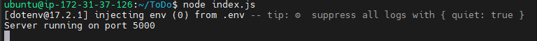
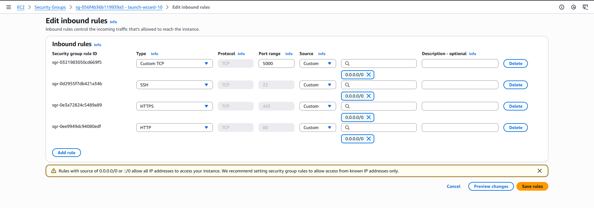
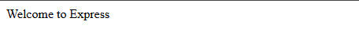

# MERN Web Stack Implementation on AWS – Todo List Application  

## 📌 Project Overview  
This project demonstrates the deployment of a **MERN (MongoDB, Express.js, React.js, Node.js)** web stack on **AWS Cloud**. The goal is to build and host a simple **Todo List Application**, showcasing full-stack development, cloud deployment, and DevOps best practices.  

The application allows users to:  
- Add tasks  
- View tasks  
- Mark tasks as completed  
- Delete tasks  

## 🏗️ Architecture  
The project is built using the **MERN stack** and deployed on **AWS EC2 instances**.  

**Key Components:**  
- **Frontend:** React.js (hosted on AWS EC2 / S3 + CloudFront for scalability)  
- **Backend:** Node.js + Express.js (running on AWS EC2)  
- **Database:** MongoDB (MongoDB Atlas / self-hosted on AWS EC2)  
- **Deployment:** Nginx/PM2 for backend, served via AWS infrastructure  

## ⚙️ Tech Stack  
- **Frontend:** React.js, Axios, Bootstrap / Material UI  
- **Backend:** Node.js, Express.js  
- **Database:** MongoDB (Atlas / AWS EC2)  
- **Cloud Provider:** AWS (EC2, S3, CloudFront, IAM, Security Groups)  
- **Process Manager:** PM2  
- **Reverse Proxy:** Nginx  

## 🚀 Steps  

### Setup AWS EC2 Instances
- Launch Ubuntu EC2 instance for backend & frontend.  
- Configure security groups to allow **HTTP (80)**, **HTTPS (443)**, and **MongoDB (27017 if self-hosted)**.  

## **Step 1 - Backend Configuraton**

### Update and upgrade ubuntu
```bash
sudo apt update && sudo apt upgrade -y
```
-  Get the location of Node.js software from Ubuntu
```bash
curl -fsSL https://deb.nodesource.com/setup_18.x | sudo -E bash -
```
- Install Node.js on the server. The command below install both nodejs and npm. NPM is a package manager for Node like apt for Ubuntu. It is used to install Node module & packages and to manage dependency conflicts
```Bash
sudo apt-get install -y nodejs
```
Verify the node installation with `node -v` and npm installation with `npm -v`

### Application Code Setup
- Create a new directory for your To-DO project
```bash
mkdir ToDo
```
- Run the command below to verify that the **ToDo** project and switch directory
```bash
ls -lih
cd ToDo
```
- Next, use the command `npm init` to intitialize your project, so that a new file **package.json** will be created. It contains information about your application and the dependencies that it needs to run and confirm that you have the file using `ls`
- Install **ExpressJS** 
```bash
npm install express
```
- Create a file **index.js** with the command below
 ```bash
 touch index.js
 ```
- Run `ls` to confirm that your index.js file is successfully created
- install the **dotenv** module
```bash
npm install dotenv
```
- Open the `index.js` with vim and paste the code below for now
```javascript
const express = require('express');
require('dotenv').config();

const app = express();

const port = process.env.PORT || 5000;

app.use((req, res, next) => {
res.header("Acess-Control-ALlow-Origin", "`*");
res.header("Access-Control-Allow-Headers", "Örigin, X-Requested-With, Content-Type, Accept");
next();
});

app.use((req, res, next) => {
res.send('Welcome to Express');
});

app.listen(port, () => {
console.log(`Server running on port ${port}`)
});
```
- Confirm if the server works. Open your terminal in the same directory as your index.js and type the below command. 
```bash
node index.js
```
If everything goes well you should see **Server running on port 5000** in your terminal. 


Now we need to open port 5000 in our security group on AWS


Try to access your Servver's public IP on port 5000 `http://<public ip>:5000`


### Route
There are three actions that our To-Do application needs to be able to do:
1. Create a new task
2. Display list of tasks
3. Delete a completed task
Each task will be associated with some particular endpoint and will use different standard **HTTP** request methods: **POST, GET, DELETE**
create a new directory `routes` that will will define various endpoints that the `To-Do` app will depend on. create a file `api.js` in the directory and paste the below code
```javascript
const express = require ('express');
const router = express.Router();

router.get('/todos', (req, res, next) => {

});

router.post('/todos', (req, res, next) => {

});

router.delete('/todos', (req, res, next) => {

});

module.exports = router;
```

### Models
Since the app is going to make use of **Mongodb** which is a NoSQL database, we need to create a model.
- Change directory back to **ToDO** folder and install Mongoose
```bash
npm install mongoose
```
- Create a new folder **models** and change directory to it. create a new file `todo.js`
```bash
mkdir models && cd models && touch todo.js
```
- Open the file and paste the JS script and save
```javascript
const mongoose = require(''mongoose');
const TodoSchema = mongoose.Schema;

// create schema for todo
const TodoSchema = new Schema({
action: {
type: String,
required: [true, 'The todo text field is required']
}
})

// create model for todo
const Todo = mongoose.model('todo', TodoSchema);

module.exports = Todo;
```
- Now, we need to update our routers from the file `api.js` in `routes` directory to make use of the new model. copy and paste

```JavaScript
const express = require ('express');
const router = express.Router();
const Todo = require('../models/todo');

router.get('/todos', (req, res, next) => {

//this will return all the data, exposing only the id and action field to the client
Todo.find({}, 'action')
.then(data => res.json(data))
.catch(next)
});

router.post('/todos', (req, res, next) => {
if(req.body.action){
Todo.create(req.body)
.then(data => res.json(data))
.catch(next)
}else {
res.json({
error: "The input field is empty"
})
}
});

router.delete('/todos/:id', (req, res, next) => {
Todo.findOneAndDelete({"_id": req.params.id})
.then(data => res.json(data))
.catch(next)
})

module.exports = router;
```


### MongoDB Database
For the mongoDB we will make use of mlab. create an account using the link `[mlab sign up](https://www.mongodb.com/products/try-free/platform/atlas-signup-from-mlab)`.
- choose **Cluster** on the left tab then click on **Create a New Cluster**. Set the folowwing configurations
1. Select the free tier
2.  Set your name
3. Choose AWS
4. Set the region close to you
Click on **Create Deployment**
- Once you have created the cluster, go to network access and click on **ALLOW ACCESS FROM ANYWHERE** then **Confirm**
[network access](assets/network-access.png)
- From your cluster click on **Create Database**, enter the **Database name** and the **collection name** then **Create**
[database]()
- Goto **Database Access** and select **ADD NEW DATABASE USER**, chose Password as authentication methods and setyour username and password hen click on **Add User**
[database-user](assets/database-user)

Once all these above steps are done. Create a `.env` file in your `ToDo` directory and add the connection string to access the database in it as seen below
```text
DB = 'mongodb+srv://<username>:<password>@cluster0.mvbzlyr.mongodb.net/?retryWrites=true&w=majority&appName=Cluster0'
```
You can get the connection string using the steps below
[cluster](assets/cluster.png)
[cluster](assets/connect.png)
[cluster](assets/drivers.png)
[cluster](assets/node-connect.png)

Finally, we need to update the `index.js`. delete the existing content and replace it with the code below
```JavaScript
const express = require('express');
const bodyParser = require('body-parser');
const mongoose = require('mongoose');
const routes = require('./routes/api');
const path = require('path');
require('dotenv').config();

const app = express();

const port = process.env.PORT || 5000;

//connect to the database
mongoose.connect(process.env.DB, { useNewUrlParser: true, useUnifiedTopology: true })
.then(() => console.log('Database connected successfully'))
.catch(err => console.log(err));

//since mongoose promise is depreciated, we override it with node's promise
mongoose.Promise = global.Promise;

app.use((req, res, next) => {
    res.header("Access-Control-Allow-Origin", "*");
    res.header("Access-Control-Allow-Headers", "Origin, X-Requested-With, Content-Type, Accept");
    next();
});

app.use(bodyParser.json());

app.use('/api', routes);

app.use((err, req, res, next) => {
    console.log(err);
    next();
});

app.listen(port, () => {
    console.log(`Server running on port ${port}`);
});

```

start your server using the command, you will see a message that **Database connected successfully**
[Database Connected](assets/success-database)


### Testing Backend Code Without Frontend using RESTful API
In this project, we will use **Postman** to test our API.
You should test all API endpoints and make sure they are workin. For example the endpoints that require bosy, you shouls send JSO back with the necessary fields.
- Create a **POST** request to the API `http://<Public ip>:500/api/todos`. This request sends a new task to our To-Do list so the application could store it in the database. set header key **Content-Type** as **application-json**
[header](assets/header.png)

check the image below
[post](assets/post.png)

- Create a **GET** request to the API on `http://<public-ip>:5000/api/todos`. this request retrieves all existing records from our To-Do application.

[get](assets/get.png)

- create a **DELETE** request to delete a task from our To-Do list. You'll need to send it's ID as a part of DELETE request

[delete](assets/delete.png)

## **Step 2 - Frontend Creation**  
It's time to create a user interface for a Web Client (Browser) to interact with the application via API. To start with out with the frontend **ToDo**, we will use the **create-react-app** command to scalfold our app. 
In the same root directory as your backend code, which is the ToDo directory, run:
```bash
npx create-react-app client
```

### Running a React App
Before running a react app, there are some dependencies that needs to be installed.
1. Install **concurrenty**, it is used to run more than one command simultaneoulsely from the same terminal window
```bash
npm install concurrently --sav-dev
```
2. install **modemon**. It is used to run and monitor the server. If there is any change in the server code, nodemon will restart it automatically and load the new changes.
```bash
npm install nodemon --save-dev
```
3. in `ToDo` folder open the `package.json` file. Change the highlighted part of the below screenshot and replace with the code below.
```json
"scripts": {
"start": "node index.js",
"start-watch": "nodemon index.js",
"dev": "concurrently \"npm run start-watch\" \"cd client && npm start\""
},
```

[Replace Scripts](asset/replace.png)

### Configure Proxy in `package.json`
1. Change directory to `client`
```bash
cd client
```
2. Open `package.json`
```bash
vi package.json
```
3. Add the key value pair in the `package.json` file "proxy": "http://localhost:5000"
The whole purpose of adding the proxy configuration in mumber 3 above is to make it possibel to access the application directly from the browser by simply calling the server url like `http://localhost:5000` rather than `http://localhost:5000/api/todos`. 

Now, make sure you are inside the `ToDo` directory and run
```bash
npm run dev
```

Your app should be open and start running on `localhost:3000`

**Note**: You need to open port 3000 on EC2

### Creatint your React Components
One of the advantages of react is that it makes use of components, which are reusable and also makes code modular. For the ToDO app, there will be two stateful components and one stateless component. From your `ToDo` directory run
```bash
cd client
```
Enter the `src` directory
```bash
cd src
```
inside your `src` folder create another folder called components
```bash
mkdir components
```
Move into the `components` directory with
```bash
cd components
```
Inside the `components` directory create three files `Input.js, ListToso.js Todo.js`
```bash
touch Input.js ListToso.js Todo.js
```
open the `Input.js`, copy and paste the below
```javascript
import React, { Component } from 'react';
import axios from 'axios';

class Input extends Component {

  state = {
    action: ""
  }

  addTodo = () => {
    const task = { action: this.state.action }

    if (task.action && task.action.length > 0) {
      axios.post('/api/todos', task)
        .then(res => {
          if (res.data) {
            this.props.getTodos();
            this.setState({ action: "" })
          }
        })
        .catch(err => console.log(err))
    } else {
      console.log('input field required')
    }
  }

  handleChange = (e) => {
    this.setState({
      action: e.target.value
    })
  }

  render() {
    let { action } = this.state;
    return (
      <div>
        <input type="text" onChange={this.handleChange} value={action} />
        <button onClick={this.addTodo}>add todo</button>
      </div>
    )
  }
}

export default Input;
```
Move back to `client` folder and install axios
```bash
cd ../..
npm install axios
```
Go to `components` directory
```bash
cd src/components
```
open `ListTodo.js`, copy and paste teh code below
```javascript
import React from 'react';

const ListTodo = ({ todos, deleteTodo }) => {

  return (
    <ul>
      {
        todos && todos.length > 0 ? (
          todos.map(todo => {
            return (
              <li key={todo._id} onClick={() => deleteTodo(todo._id)}>
                {todo.action}
              </li>
            )
          })
        ) : (
          <li>No todo(s) left</li>
        )
      }
    </ul>
  )
}

export default ListTodo;
```
lastly, in the `Todo.js`, copy and paste the code below
```javascript
import React, { Component } from 'react';
import axios from 'axios';

import Input from './Input';
import ListTodo from './ListTodo';

class Todo extends Component {

  state = {
    todos: []
  }

  componentDidMount() {
    this.getTodos();
  }

  getTodos = () => {
    axios.get('/api/todos')
      .then(res => {
        if (res.data) {
          this.setState({
            todos: res.data
          })
        }
      })
      .catch(err => console.log(err))
  }

  deleteTodo = (id) => {
    axios.delete(`/api/todos/${id}`)
      .then(res => {
        if (res.data) {
          this.getTodos()
        }
      })
      .catch(err => console.log(err))
  }

  render() {
    let { todos } = this.state;

    return (
      <div>
        <h1>My Todo(s)</h1>
        <Input getTodos={this.getTodos} />
        <ListTodo todos={todos} deleteTodo={this.deleteTodo} />
      </div>
    )
  }
}

export default Todo;
```

We need to make some adjustment to our react code. Delete the logo and adjust our `App.js`. Move to the src folder and open `App.js` copy and paste the below code
```javascript
import React from 'react';

import Todo from './components/Todo';
import './App.css';

const App = () => {
return (
<div className="App">
<Todo />
</div>
);
}

export default App;
```

in the same `src` directory open the `App.css`. copy and paste the code below
```css
.App {
  text-align: center;
  font-size: calc(10px + 2vmin);
  width: 60%;
  margin-left: auto;
  margin-right: auto;
}

input {
  height: 40px;
  width: 50%;
  border: none;
  border-bottom: 2px #101113 solid;
  background: none;
  font-size: 1.5rem;
  color: #787a80;
}

input:focus {
  outline: none;
}

button {
  width: 25%;
  height: 45px;
  border: none;
  margin-left: 10px;
  font-size: 25px;
  background: #101113;
  border-radius: 5px;
  color: #787a80;
  cursor: pointer;
}

button:focus {
  outline: none;
}

ul {
  list-style: none;
  text-align: left;
  padding: 15px;
  background: #171a1f;
  border-radius: 5px;
}

li {
  padding: 15px;
  font-size: 1.5rem;
  margin-bottom: 15px;
  background: #282c34;
  border-radius: 5px;
  overflow-wrap: break-word;
  cursor: pointer;
}

@media only screen and (min-width: 300px) {
  .App {
    width: 80%;
  }

  input {
    width: 100%;
  }

  button {
    width: 100%;
    margin-top: 15px;
    margin-left: 0;
  }
}

@media only screen and (min-width: 640px) {
  .App {
    width: 60%;
  }

  input {
    width: 50%;
  }

  button {
    width: 30%;
    margin-left: 10px;
    margin-top: 0;
  }
}
```

In the same directory open `index.css`. Copy and past the code below
```css
body {
  margin: 0;
  padding: 0;
  font-family: -apple-system, BlinkMacSystemFont, "Segoe UI", "Roboto", "Oxygen", 
               "Ubuntu", "Cantarell", "Fira Sans", "Droid Sans", "Helvetica Neue", 
               sans-serif;
  -webkit-font-smoothing: antialiased;
  -moz-osx-font-smoothing: grayscale;
  box-sizing: border-box;
  background-color: #282c34;
  color: #787a80;
}

code {
  font-family: source-code-pro, Menlo, Monaco, Consolas, "Courier New", monospace;
}
```

Go to the `ToDo` directory and run
```bash
npm run dev
```


- Deploy build files with **Nginx** or serve via **S3 + CloudFront** for scalability.

### 6. **MongoDB Setup**  
- Option 1: Use **MongoDB Atlas** (recommended for production).  
- Option 2: Install MongoDB on AWS EC2:  
  ```bash
  sudo apt install -y mongodb
  sudo systemctl start mongodb
  sudo systemctl enable mongodb
  ```

### 7. **Reverse Proxy with Nginx**  
Configure Nginx to route traffic to the backend and serve the frontend build.  

### 8. **Access the Application**  
Open your browser and navigate to your **EC2 public IP / domain**.  

## 📂 Project Structure  
```
mern-todo-aws/
│── backend/        # Express.js + Node.js API
│   ├── models/     # Mongoose models
│   ├── routes/     # API routes
│   └── server.js   # Entry point
│
│── client/         # React.js frontend
│   ├── public/
│   └── src/
│
└── README.md       # Documentation
```

## ✅ Features  
- Create, Read, Update, Delete (CRUD) tasks  
- Persistent storage with MongoDB  
- RESTful API with Express.js  
- Deployed on AWS for scalability and availability  

## 🔒 Security Considerations  
- Use **IAM roles** and **Security Groups** to control access.  
- Use **HTTPS (SSL/TLS)** for secure communication.  
 

## 📜 License  
This project is licensed under the MIT License.  
